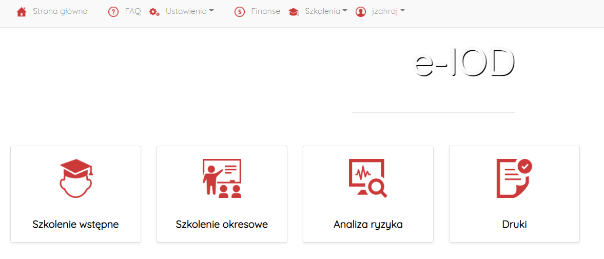
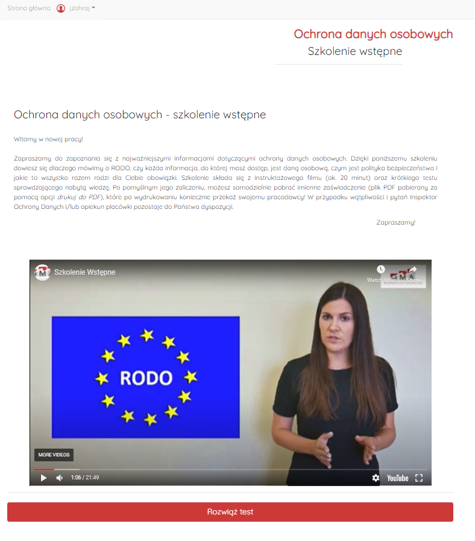
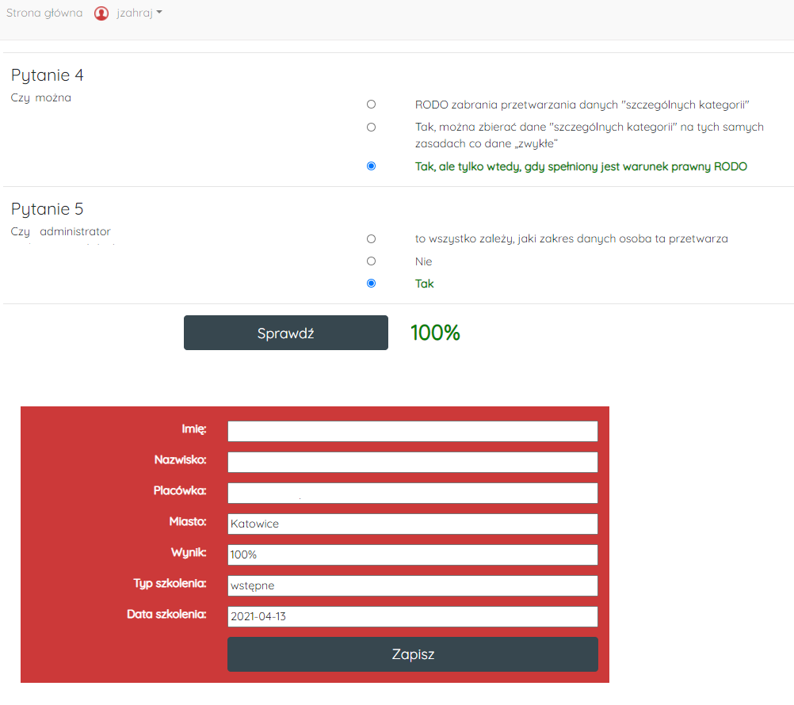
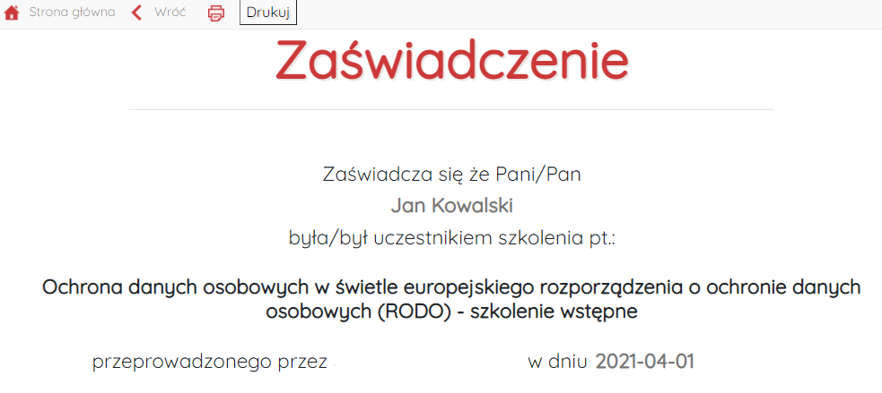
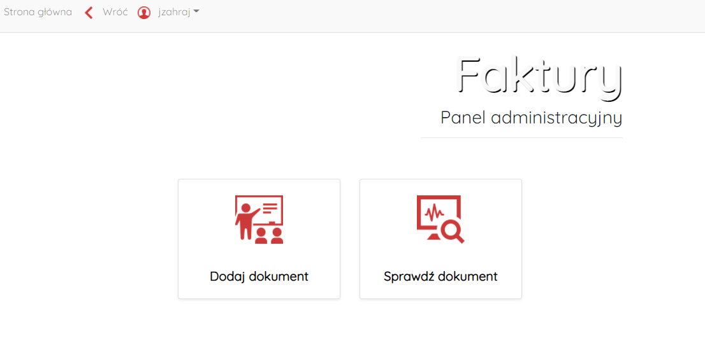
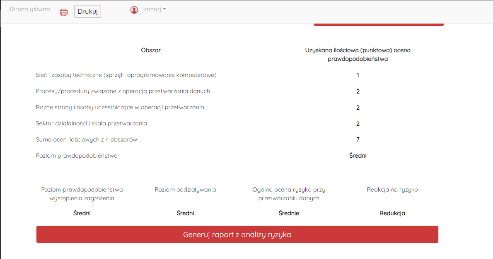
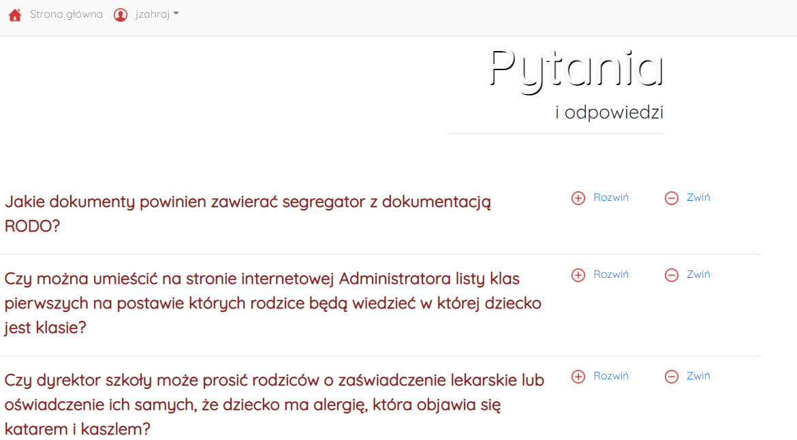

# IODapp
## Application for Administrators and Data Protector Officers
---

## Table of contents
* [General info](#General-info)
* [Technologies](#technologies)
* [Look of app](#look-of-app)
* [Features](#features)
* [To do](#todo)
* [Project status](#status)

<a name="General-info">

### General info
The aim of the project was to create a web application for managing GDPR documentation. It includes a training module, a risk analysis module and a financial module.

The application is still being expanded to create the perfect dependency diagram between modules and ultimately create a commercial, well-coded version.

This version has been used since August 2020 mainly to present GDPR thematic training for employees.

The pandemic and lockdown were the reasons for writing this type of application because it was not possible to train employees using the traditional method. The application was created as a non-profit project.

<a name="technologies">

### Technologies

* PHP
* Javascript
* Bootstrap v4.4.1
* HTML
* CSS

<a name="look-of-app">

### Look of app

#### Main panel
---

#### Training panel
---

#### Training panel - test
---

#### Training panel - certificate
---

#### Financial panel
---

#### Risk analysis panel
---

#### FAQ
---

<a name="features">

### Features
* presentation of GDPR trainings
* introduction to the database of information about the employee who completed the GDPR training
* creating a confirmation certificate
* downloading a list of employees who have completed the GDPR training
* conducting a GDPR risk analysis and creating a GDPR risk analysis card
* download documentation forms
* Presentation of frequently asked questions and important information
* adding invoices for customers
* deleting invoices from the database
* Log In, Log out
* password change

<a name="todo">

### To do
Rebuilding the application using the Angular framework. Rebuilding the code in order to obtain a transparent and object-oriented form.

<a name="status">

### Project status
In use. 

